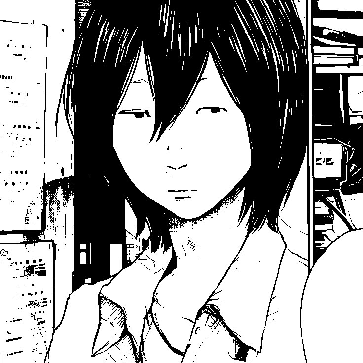

## Hi there 👋

<!--  -->

 

&nbsp;● Name **Sid** **Ali** .₊˚🎧⊹
 
 

&nbsp;● Live in **Dijon , France** &nbsp;⋆.🌑.ೃ
 
 
 
&nbsp;● Currently a student in **Master's degree in Database/AI** &nbsp;ˋ𓆩🔘ˊ˗⭒
 
 
 
&nbsp;● Confident in **Java** / **JavaScript** / **C++** &nbsp;˖°♟️✧'
 
 

&nbsp;● Skilled in **Photoshop** & **Blender**  &nbsp;₊⊹݁☁️⊰˚
 
 
 
 

 

● <strong>Projet d'application mobile</strong> 📱

<a href="https://github.com/sbpxx/M1-Programmation-Mobile">M1 - Programmation mobile</a>

 

● <strong>Application de gestion de contacts</strong> 👥

<a href="https://github.com/sbpxx/L3-CDAA">L3 - CDAA</a>

 

● <strong>AI-powered university assistant</strong> 🤖

<a href="https://github.com/sbpxx/M2-Noctua-Ai">M2 - Noctua AI</a>

 
 
 
 
 
 
 
 
 
 
 
 
 

<!--

**0x5id/0x5id** is a ✨ _special_ ✨ repository because its `README.md` (this file) appears on your GitHub profile.

Here are some ideas to get you started:

- 🔭 I’m currently working on ...
- 🌱 I’m currently learning ...
- 👯 I’m looking to collaborate on ...
- 🤔 I’m looking for help with ...
- 💬 Ask me about ...
- 📫 How to reach me: ...
- 😄 Pronouns: ...
- ⚡ Fun fact: ...
-->
